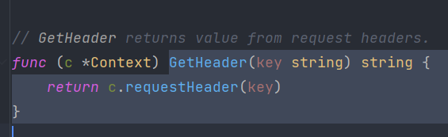
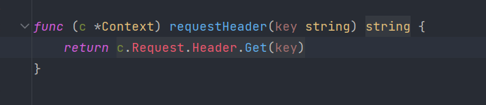
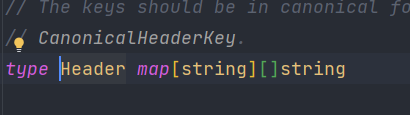
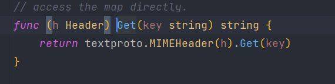
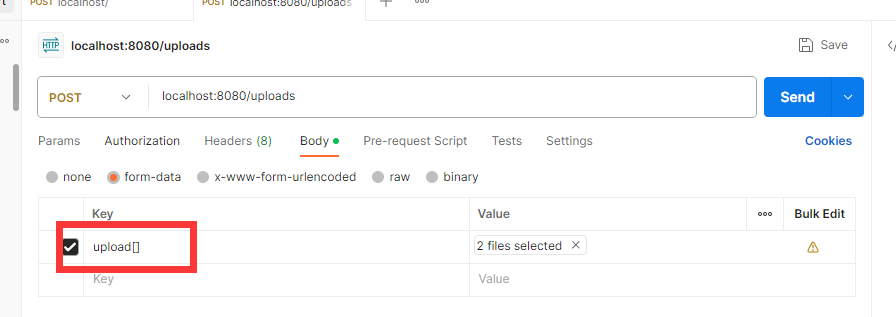
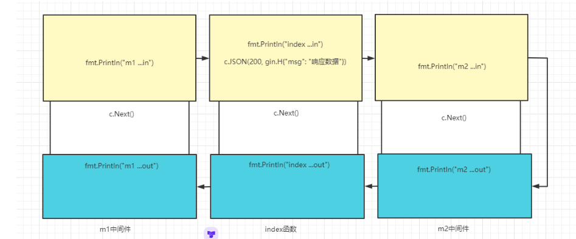

#                                                                                                                                                                                                                                                                                                                                                                                                                                                                                                                                                                                                                                                                                                                                                                                                                                                                                                                                                                                                                                                                                                                                                                                                                                                                                                                                                                                                                                                                                                                                                                                                                                                                                                                                                                                                                                                                                                                                                                                                                                                                                                                                                                                                                                                                                                                                                                                                                                                                                                                                                                                                                                                                                                                                                                                                                                                                                                                                                                                                                                                                                                                                                                                                                                                                                                                                                                                                                                                                                                                                                                                                                                                                                                                                                                                                                                                                                                                                                                                                                                                                                                                                                                                                                                                                                                                                                                                                                                                                                                                                                                                                                                                                                                                                                                                                                                                                                                                                                                                                                                                                                                                                                                                                                                                                                                                                                                                                                                                                                                                                                                                                                                                                                                                                                                                                                                                                                                                                                                                                                                                                                                                                                                                                                                                                                                                                                                                                                                                                                                                                                                                                                                                                                                                                                                                                                                                                                                                                                                                                                                                                                                                                                                                                                                                                                                                                                                                                                                                                                                                                                                                                                                                                                                                                                                                                                                                                                                                                                                                                                                                                                                                                                                                                                                                                                                                                                                                                                                                                                                                                                                                                                                                                                                                                                                                                                                                                                                                                                                                                                                                                                                                                                                                                                                                                                                                                                                                                                                                                                                                                                                                                                                                                                                                                                                                                                                                                                                                                                                                                                                                                                                                                                                                                                                                                                                                                                                                                                                                                                                                                                                                                                                                                                                                                                                                                                                                                                                                                                                                                                                                                                                                                                                                                                                                                                                                                                                                                                                                                                                                                                                                                                                                                                                                                                                                                                                                                                                                                                                                                                                                                                                                                                                                                                                                                                                                                                                                                                                                                                                                                                                                                                                                                                                                                                                                                                                                                                                                                                                                                                                                                                                                                                                                                                                                                                                                                                                                                                                                                                                                                                                                                                                                                                                                                                                                                                                                                                                                                                                                                                                                                                                                                                                                                                                                                                                                                                                                                                                                                                                                                                                                                                                                                                                                                                                                                                                                                                                                                                                                                                                                                                                                                                                                                                                                                                                                                                                                                                                                                                                                                                                                                                                                                                                                                                                                                                                                                                                                                                                                                                                                                                                                                                                                                                                                                                                                                                                                                                                                                                                                                                                                                                                                                                                                                                                                                                                                                                                                                                                                                                                                                                                                                                                                                                                                                                                                                                                                                                                                                                                                                                                                                                                                                                                                                                                                                                                                                                                                                                                                                                                                                                                                                                                                                                                                                                                                                                                                                                                                                                                                                                                                                                                                                                                                                                                                                                                                                                                                                                                                                                                                                                                                                                                                                                                                                                                                                                                                                                                                                                                                                                                                                                                                                                                                                                                                                                                                                                                                                                                                                                                                                                                                                                                                                                                                                                                                                                                                                                                                                                                                                                                                                                                                                                                                                                                                                                                                                                                                                                                                                                                                                                                                                                                                                                                                                                                                                                                                                                                                                                                                                                                                                                                                                                                                                                                                                                                                                                                                                                                                                                                                                                                                                                                                                                                                                                                                                                                                                                                                                                                                                                                                                                                                                                                                                                                                                                                                                                                                                                                                                                                                                                                                                                                                                                                                                                                                                                                                                                                                                                                                                                                                                                                                                                                                                                                                                                                                                                                                                                                                                                                                                                                                                                                                                                                                                                                                                                                                                                                                                                                                                                                                                                                                                                                                                                                                                                                                                                                                                                                                                                                                                                                                                                                                                                                                                                                                                                                                                                                                                                                                                                                                                                                                                                                                                                                                                                                                                                                                                                                                                                                                                                                                                                                                                                                                                                                                                                                                                                                                                                                                                                                                                                                                                                                                                                                                                                                                                                                                                                                                                                                                                                                                                                                                                                                                                                                                                                                                                                                                                                                                                                                                                                                                                                                                                                                                                                                                                                                                                                                                                                                                                                                                                                                                                                                                                                                                                                                                                                                                                                                                                                                                                                                                                                                                                                                                                                                                                                                                                                                                                                                                                                                                                                                                                                                                                                                                                                                                                                                                                                                                                                                                                                                                                                                                                                                                                                                                                                                                                                                                                                                                                                                                                                                                                                                                                                                                                                                                                                                                                                                                                                                                                                                                                                                                                                                                                                                                                                                                                                                                                                                                                                                                                                                                                                                                                                                                                                                                                                                                                                                                                                                                                                                                                                                                                                                                                                                                                                                                                                                                                                                                                                                                                                                                                                                                                                                                                                                                                                                                                                                                                                                                                                                                                                                                                                                                                                                                                                                                                                                                                                                                                                                                                                                                                                                                                                                                                                                                                                                                                                                                                                                                                                                                                                                                                                            1-Gin框架概述

Gin 是一个轻量级的Web框架技术，通过导入`github.com/gin-gonic/gin` 来导入框架所需的所有模组


导入命令：

````bash
go get -u github.com/gin-gonic/gin
````


**Gin Hello World**

> 使用gin编写一个接口十分简单

> 01-HelloWorld/1.hello_world.go

````go
package main

import "github.com/gin-gonic/gin"

func main() {
	//创建一个默认的路由

	router := gin.Default()

	router.GET("/index", func(c *gin.Context) {
		c.String(200, "hello NanCheng_7")
	})

	router.Run("0.0.0.0:8080")
}

````

> 1. `router := gin.Default()` ： 这是默认的服务器。使用gin的`Default`方法创建一个路由`Handler`
> 2. 通过http方法绑定路由规则和路由函数。不同于`net/http`库的路由函数，gin进行了封装，吧`requset`和`response`都封装到了`gin.Context`的上下文环境中。
> 3. 最后启动路由的Run方法监听端口。还可以用`http.ListenAndServe(":8080",router)`，或者自定义http服务器配置

**两种启动方式**

````go
// 启动方式1
router.Run(":8080")

//启动方式2
http.ListenAndServe(":8080",router)
````

**修改ip为内网ip**

````go
router.Run("0.0.0.0:8080")
````

````go
package main

import (
  "github.com/gin-gonic/gin"
  "net/http"
)

func Index(context *gin.Context) {
  context.String(200, "Hello 枫枫!")
}
func main() {

  // 创建一个默认的路由
  router := gin.Default()

  // 绑定路由规则和路由函数，访问/index的路由，将由对应的函数去处理
  router.GET("/index", Index)

  // 启动监听，gin会把web服务运行在本机的0.0.0.0:8080端口上
  router.Run("0.0.0.0:8080")
  // 用原生http服务的方式， router.Run本质就是http.ListenAndServe的进一步封装
  http.ListenAndServe(":8080", router)
}

````

# 2-响应

**状态码**

200 表示正常响应 http.StatusOK


**返回字符串**

````go
router.GET("/txt",func(c *gin.Context) {
    c.String(http.StatusOK,"返回txt")
}
````


**返回json**

````go
router.GET("/json", func(c *gin.Context) {
  c.JSON(http.StatusOK, gin.H{"message": "hey", "status": http.StatusOK})
})
// 结构体转json
router.GET("/moreJSON", func(c *gin.Context) {
  // You also can use a struct
  type Msg struct {
    Name    string `json:"user"`
    Message string
    Number  int
  }
  msg := Msg{"fengfeng", "hey", 21}
  // 注意 msg.Name 变成了 "user" 字段
  // 以下方式都会输出 :   {"user": "hanru", "Message": "hey", "Number": 123}
  c.JSON(http.StatusOK, msg)
}
````


返回xml

````go
router.GET("/xml",func(c *gin.Context){
    c.XML(http.StatusOK,gin.H("user" : "NanCheng","message" : "key","status" : http.StatusOK))
})
````

返回yaml

````go
router.GET("/yml",func(c *Context) {
    c.YAML(http.StatusOK,gin.H{"user" : "NanCheng","Message":"this is yml"})
})
````

**文件响应**

````go
// golang 中，没有相对文件的路径，它只有相对项目的路径
//网页请求这个静态目录的前缀，第二个参数是一个目录，注意，前缀不要重复
router.StaticFS("/static",http.Dir("static/static"))
// 配置单个文件，网页请求的路由，文件的路径
router.StaticFile("/ ")
````

**重定向**

````go
func _redirect(c *gin.Context) {
	c.Redirect(302, "http://www.baidu.com")
}
````
> 301 和 302 的区别：
> 301是永久重定向，如果用户点击了该重定向，浏览器回缓存，就算服务器更改了该重定向指定的地址，该用户再次点击，浏览器
> 会将用户重定向到缓存的地址，而不会再次请求服务器，而302是临时重定向，如果用户点击了该重定向，浏览器会再次请求服务器，

# 3-请求

## 参数查询 Query

```go
func _query(c *gin.Context) {
	user := c.Query("user")
	fmt.Println(user)
	fmt.Println(c.GetQuery("user"))
	fmt.Println(c.GetQueryArray("user")) //?user=a&user=b
	fmt.Println(c.GetQueryMap("us"))	//?us[a]=66&us[b]=77

}
```

> 要注意：
>
> ​	这里如果请求的参数没有user,则会返回user变量为一个空值，但是使用GetQuery返回的bool是true。
>
> 也就是说：
>
> ​	传了和没传的判断是参数列表是否有对应键值对，但是其值是否存在，GetQuery方法无法确定，所以需要对其返回的值做判断

> queryMap的使用：
>
> ​	查询参数列表： ?us[a]=66&us[b]=88

## 动态参数 Param

```go
func _param(c *gin.Context) {
   fmt.Println(c.Param("user_id"))
   fmt.Println(c.Param("book_id"))
}

	router.GET("/param/:user_id", _param)
	router.GET("/param/:user_id/:book_id", _param)

// param/666/777
```


## 表单 FormData

> 可以接收`multipart/form-data; `和`application/x-www-form-urlencoded`

```go
func _form(c *gin.Context) {
   fmt.Println(c.PostForm("name"))               //访问第一个
   fmt.Println(c.PostFormArray("name"))          //访问列表
   fmt.Println(c.DefaultPostForm("addr", "四川省")) // 如果用户没传，就使用默认值
   forms, err := c.MultipartForm()               // 接收所有的form参数，包括文件
   fmt.Println(forms, err)
}
```

## 原始参数 GetRawData

```go
func _raw(c *gin.Context) {
  body, _ := c.GetRawData()
  contentType := c.GetHeader("Content-Type")
  switch contentType {
  case "application/json":
  
    // json解析到结构体
    type User struct {
      Name string `json:"name"`
      Age  int    `json:"age"`
    }
    var user User
    err := json.Unmarshal(body, &user)
    if err != nil {
      fmt.Println(err.Error())
    }
    fmt.Println(user)
  }
}
```

## 四大请求方式 `GET POST PUT DELETE `

> Restful风格指的是网络应用中就是资源定位和资源操作的风格。不是标准也不是协议。
>
> GET：从服务器取出资源（一项或多项）
>
> POST：在服务器新建一个资源
>
> PUT：在服务器更新资源（客户端提供完整资源数据）
>
> PATCH：在服务器更新资源（客户端提供需要修改的资源数据）
>
> DELETE：从服务器删除资源

> 以文章的数据库表操作为例:
>
> > GET 			/articles		文章列表
> >
> > GET 			/articles/:id  文章详情
> >
> > POST		  /articles 		添加文章
> >
> > PUT			/articles/:id   修改某一篇文章
> >
> > DELETE     /articles/:id    删除某一篇文章


> Go 代码
````go
package main

import (
	"encoding/json"
	"fmt"
	"github.com/gin-gonic/gin"
)

type ArticleModel struct {
	Content string `json:"content"`
	Title   string `json:"title"`
}
type Response struct {
	Code int    `json:"code"`
	Data any    `json:"data"`
	Msg  string `json:"msg"`
}

// _getList 文章列表页面
func _getList(c *gin.Context) {

	articleList := []ArticleModel{
		{"上课", "震惊"},
		{"女神", "震惊"},
		{"老师", "震惊"},
	}

	c.JSON(200, Response{0, articleList, "请求成功"})
}

// _getDetail 文章详情页面
func _getDetail(c *gin.Context) {
	// 获取param 的id
	fmt.Println(c.Param("id"))
	result := ArticleModel{"上课", "震惊"}
	c.JSON(200, Response{0, result, "查询成功"})
}

// _create 文章创建页面
func _create(c *gin.Context) {
	//接收前端的JSON
	var articles ArticleModel

	err := _bindJson(c, &articles)
	if err != nil {
		fmt.Println(err)
		return
	}

	c.JSON(200, Response{0, articles, "添加成功"})
}

// _update 编辑文章
func _update(c *gin.Context) {
	//接收id
	fmt.Println(c.Param("id"))

	//接收前端的JSON
	var articles ArticleModel

	err := _bindJson(c, &articles)
	if err != nil {
		fmt.Println(err)
		return
	}
	c.JSON(200, Response{0, articles, "修改成功"})
}

func _delete(c *gin.Context) {

	//接收id
	id := c.Param("id")
	fmt.Println(id)
	c.JSON(200, Response{0, id, "删除成功"})
}

func main() {
	router := gin.Default()

	// Create a router for the articles endpoint
	router.GET("/articles", _getList)
	// Create a GET request for the articles endpoint
	router.GET("/articles/:id", _getDetail)
	// Create a POST request for the articles endpoint
	router.POST("/articles", _create)
	// Create a PUT request for the articles endpoint
	router.PUT("/articles/:id", _update)
	// Create a DELETE request for the articles endpoint
	router.DELETE("/articles/:id", _delete)
	router.Run(":80")
}

func _bindJson(c *gin.Context, obj any) (err error) {
	body, _ := c.GetRawData()
	contentType := c.GetHeader("Content-Type")
	switch contentType {
	case "application/json":
		err = json.Unmarshal(body, &obj)
		if err != nil {
			fmt.Println(err.Error())
			return err
		}
	}
	return nil
}

````


## 请求头相关

### 1.请求头参数获取

```go
package main

import (
	"fmt"
	"github.com/gin-gonic/gin"
	"strings"
)

func main() {
	router := gin.Default()
	//请求头的各种获取方式
	router.GET("/", func(c *gin.Context) {
		// 字母大小写不区分 单词与单词之间是用 - 连接
		// 获取单个请求头
		fmt.Println(c.GetHeader("User-Agent"))
		fmt.Println(c.GetHeader("user-agent"))
		fmt.Println(c.GetHeader("user-Agent"))

		//获取全部请求头
		fmt.Println(c.Request.Header)
		fmt.Println(c.Request.Header["User-Agent"])
		// 没有通过 get方法进行转换，导致无法无视大小写
		fmt.Println(c.Request.Header["User-agent"])

		//如果是使用的自定义的请求头，也是可以使用get方法无视大小写
		fmt.Println(c.GetHeader("token"))
		fmt.Println(c.GetHeader("Token"))
		c.JSON(200, gin.H{"msg": "成功"})
	})

	//爬虫和用户区别对待
	router.GET("/index", func(c *gin.Context) {
		userAgent := c.GetHeader("User-Agent")

		if strings.Contains(userAgent, "python") {
			// 爬虫
			c.JSON(0, gin.H{"msg": "爬虫"})
		}
		c.JSON(0, gin.H{"msg": "用户"})

	})

	router.Run(":80")
}

```

>  通过如下图片可以看到，我们在使用`GetHead()`方法时，实际上是调用了requestHeader()方法来查找请求头的Key
>
> 

> 但是点进requestHeader里我们可以看到实际上返回的是c.Request.Header对象的Get方法，那么Header对象又是什么呢？
>
> 

> 可以看到实际上的Header对象是一个`Map[string][]string`对象，那么为什么我们使用get方法可以无视大小写进行传参查询呢？
>
> 

> 最终我们发现，是Header对象的get方法对传入的参数进行了处理，所以才可以无视大小写进行传参。
>
> 

## 响应头相关

### 设置响应头

```go
package main

import "github.com/gin-gonic/gin"

// _setRespHeader 设置响应头
func _setRespHeader(c *gin.Context) {
	c.Header("token", "NanCheng")
	// 在这里修改content-type可以修改响应的数据类型，这里直接放回text，浏览器会把他当作文本下载
	c.Header("content-type", "application/text; charset=utf-8")
	c.JSON(0, gin.H{"msg": "看看响应头"})
}

func main() {
   router := gin.Default()

   router.GET("/resp", _setRespHeader) // 设置响应头

   router.Run(":80")
}
```


# 4-Bind绑定器


 **bind绑定参数**

gin 中的bind 可以很方便的将前端传递来的`数据`与`结构体`进行参数绑定，以及参数校验


**参数绑定**

 ==在使用这个功能的时候，需要给结构体加上Tag `json` `form` `uri` `xml` `yaml`==

## Must Bind

==一般不使用，检验失败会修改状态码==

## **ShouldBind**

可以绑定json，query，param，yaml，xml

如果校验不通过会返回错误


*Should Bind JSON*

````go
// ShouldBind JSON
func _ShouldBindJSON(c *gin.Context) {
	var userInfo UserInfo
	err := c.ShouldBindJSON(&userInfo)
	if err != nil {
		c.JSON(200, gin.H{"msg": "你错了"})
		return
	}
	c.JSON(200, userInfo)
}

````

> 通过使用 `ShouldBindJSON`函数我们可以绑定前端传入的JSON到对应的结构体中，前提是我们的结构体里添加了JSON的Tag，如果前端的数据和后端绑定结构体的数据格式不一致，则会报错，我们可以通过err来自定义报错返回的信息。

*Should BInd Query*

````go
// ShouldBind Query
func _ShouldBindQuery(c *gin.Context) {
	var userInfo UserInfo
	err := c.ShouldBindQuery(&userInfo)
	if err != nil {
		fmt.Println(err)
		c.JSON(200, gin.H{"msg": "你错了"})
		return
	}
	c.JSON(200, userInfo)
}
````

> 与上述的Should Bind JSON 一致，我们这里会将查询的参数绑定到结构体，并且进行数据类型的校验，同样也可以自定义报错信息。

*Should Bind Uri*

````go
// ShouldBind Uri
func _ShouldBindUri(c *gin.Context) {
	var userInfo UserInfo
	err := c.ShouldBindUri(&userInfo)
	if err != nil {
		c.JSON(200, gin.H{"msg": "你错了"})
		return
	}
	c.JSON(200, userInfo)
}


	//Should Bind Uri
	router.POST("/uri/:name/:age/:sex", _ShouldBindUri)
````

> 这里的uri是指我们在使用动态参数时，将路径的参数绑定至结构体内，并且会校验类型。

*Should Bind*

```go
// ShouldBind
func _ShouldBind(c *gin.Context) {
	var userInfo UserInfo
	err := c.ShouldBind(&userInfo)
	if err != nil {
		c.JSON(200, gin.H{"msg": "你错了"})
	}
	c.JSON(200, userInfo)
}
```


> ShouldBind会根据请求头中的content-type去自动绑定指定的tag
>
> form-data的参数也用这个，tag用form
>
> 如果不指定content-type的话，默认的tag就是form

## **Bind 绑定器**

当我们在接受前端的数据进入结构体时，可以使用bind的参数验证功能，但是需要添加bingding tag


### 常用验证器

```go
// 不能为空，并且不能没有这个字段
required: 必填字段，如：binding:"required"

//针对字符串的长度
min 最小长度，如：binding:"min=5"
max 最大长度，如：binding:"max=10"
len 长度，如：binding:"len=6"

// 针对数字的大小
eq 等于，如：binding:"eq=3"
ne 不等于，如：binding:"ne=12"
gt 大于，如：binding:"gt=10"
gte 大于等于，如：binding:"gte=10"
lt 小于，如：binding:"lt=10"
lte 小于等于，如：binding:"lte=10"

// 针对同级字段的
eqfield 等于其他字段的值，如：PassWord string `binding:"eqfield=Password"`
nefield 不等于其他字段的值


- 忽略字段，如：binding:"-"
```


### gin 内置验证器

````go
// 枚举  只能是red 或green
oneof=red green 

// 字符串  
contains=fengfeng  // 包含fengfeng的字符串
excludes // 不包含
startswith  // 字符串前缀
endswith  // 字符串后缀

// 数组
dive  // dive后面的验证就是针对数组中的每一个元素

// 网络验证
ip
ipv4
ipv6
uri
url
// uri 在于I(Identifier)是统一资源标示符，可以唯一标识一个资源。
// url 在于Locater，是统一资源定位符，提供找到该资源的确切路径

// 日期验证  1月2号下午3点4分5秒在2006年
datetime=2006-01-02
````

### 自定义错误信息

>  当验证不通过时，会给出错误的信息，但是原始的错误信息不太友好，不利于用户查看
>
> 只需要给结构体加一个msg 的tag

```go
type UserInfo struct {
  Username string `json:"username" binding:"required" msg:"用户名不能为空"`
  Password string `json:"password" binding:"min=3,max=6" msg:"密码长度不能小于3大于6"`
  Email    string `json:"email" binding:"email" msg:"邮箱地址格式不正确"`
}
```

> 当出现错误时，就可以来获取出错字段上的msg。
>
> - `err`：这个参数为`ShouldBindJSON`返回的错误信息
> - `obj`：这个参数为绑定的结构体
> - **还有一点要注意的是，validator这个包要引用v10这个版本的，否则会出错**

````go
// GetValidMsg 返回结构体中的msg参数
func GetValidMsg(err error, obj any) string {
  // 使用的时候，需要传obj的指针
  getObj := reflect.TypeOf(obj)
  // 将err接口断言为具体类型
  if errs, ok := err.(validator.ValidationErrors); ok {
    // 断言成功
    for _, e := range errs {
      // 循环每一个错误信息
      // 根据报错字段名，获取结构体的具体字段
      if f, exits := getObj.Elem().FieldByName(e.Field()); exits {
        msg := f.Tag.Get("msg")
        return msg
      }
    }
  }

  return err.Error()
}
````

### 自定义验证器

1. 注册验证器函数

```go
// github.com/go-playground/validator/v10
// 注意这个版本得是v10的

if v, ok := binding.Validator.Engine().(*validator.Validate); ok {
   v.RegisterValidation("sign", signValid)
}
```

2. 编写验证器逻辑

````go
// 如果用户名不等于fengfeng就校验失败
func signValid(fl validator.FieldLevel) bool {
  name := fl.Field().Interface().(string)
  if name != "fengfeng" {
    return false
  }
  return true
}
````

3. 使用

````go
type UserInfo struct {
  Name string `json:"name" binding:"sign" msg:"用户名错误"`
  Age  int    `json:"age" binding:""`
}
````


```go
package main

import (
   "github.com/gin-gonic/gin"
   "github.com/gin-gonic/gin/binding"
   "github.com/go-playground/validator/v10"
   "reflect"
)

type User9 struct {
   Name string `json:"name" binding:"required,sign" msg:"用户名校验失败"`
   Age  int    `json:"age" binding:"required" msg:"请输入年龄"`
}

func _login(c *gin.Context) {
   var user User9
   if err := c.ShouldBindJSON(&user); err != nil {
      c.JSON(200, gin.H{
         "msg": _returnErrorMessage(err, &user),
      })
      return
   }
   c.JSON(200, gin.H{
      "msg": user,
   })
}

func signValid(fl validator.FieldLevel) bool {
   var nameList = []string{"NanCheng", "NanCY"}
   for _, nameStr := range nameList {
      fieldName := fl.Field().Interface().(string)
      if nameStr == fieldName {
         return false
      }
   }
   return true
}
func _returnErrorMessage(err error, obj any) string {
   getObj := reflect.TypeOf(obj)
   if errs, isError := err.(validator.ValidationErrors); isError {
      // 断言成功
      for _, e := range errs {
         //循环判断是否有字段报错
         // 如果有久通过反射获取Tag 并且返回Tag的msg
         if field, exist := getObj.Elem().FieldByName(e.Field()); exist {
            msg := field.Tag.Get("msg")
            return msg
         }
      }
   }
   return ""
}
func main() {
   router := gin.Default()

   if v, ok := binding.Validator.Engine().(*validator.Validate); ok {
      v.RegisterValidation("sign", signValid)
   }

   router.POST("/", _login)

   router.Run(":80")
}
```

# 5-文件上传和下载

## 文件上传

### 单文件

````go
// _fileLoad 单文件上传
func _fileLoad(c *gin.Context) {
	// 获取文件
	file, err := c.FormFile("file")
	if err != nil {
		c.JSON(200, gin.H{"code": 200, "msg": "上传文件失败"})
		return
	}
	//第一种保存文件
	//c.SaveUploadedFile(file, "./loadFile/"+file.Filename)

	//第二种
	//获取字节流
	readFile, err := file.Open()
	if err != nil {
		c.JSON(200, gin.H{"code": 200, "msg": "上传文件失败"})
		return
	}
	// 创建文件
	out, err := os.Create("./loadFile/xx.txt")
	// 异常捕获
	defer func(out *os.File) {
		err := out.Close()
		if err != nil {

		}
	}(out)
	// 复制文件流
	_, es := io.Copy(out, readFile)
	if es != nil {
		return
	}

	c.JSON(200, gin.H{"code": 200, "msg": "上传文件成功"})

}
````


### 服务端保存文件的几种方式


**SaveUploadedFile**

```go
c.SaveUploadedFile(file, "./loadFile/"+file.Filename)
```


**Create + Copy**

> file.Open的第一个返回值就是我们讲文件对象中的那个文件（只读的），我们可以使用这个去直接读取文件内容

```go
//获取字节流
readFile, err := file.Open()
if err != nil {
   c.JSON(200, gin.H{"code": 200, "msg": "上传文件失败"})
   return
}
// 创建文件
out, err := os.Create("./loadFile/xx.txt")
// 异常捕获
defer func(out *os.File) {
   err := out.Close()
   if err != nil {

   }
}(out)
// 复制文件流
_, es := io.Copy(out, readFile)
if es != nil {
   return
}
```

**读取上传的文件**

```go
file, _ := c.FormFile("file")
// 读取文件中的数据，返回文件对象
fileRead, _ := file.Open()
data, _ := io.ReadAll(fileRead)
fmt.Println(string(data))
```

> 这里的玩法就很多了
>
> 例如我们可以基于文件中的内容，判断是否需要保存到服务器中

### 多文件上传

```go
// _multiFileLoad 多文件上传
func _multiFileLoad(c *gin.Context) {
   //获取所有的文件 form 实际是一个map[string][]*FileHeader
   form, _ := c.MultipartForm()

   files := form.File["upload[]"] //前端传参的名字需要对应
   for _, file := range files {
      c.SaveUploadedFile(file, "./loadFile/"+file.Filename)
   }

   c.JSON(200, gin.H{"msg": "上传成功! 上传了" + fmt.Sprintf(" %d 个文件", len(files))})
}
```



## 文件下载

### 直接响应一个路径的文件


``c.File("uploads/12.png")``

> 有些响应，比如图片，浏览器就会显示这个图片，而不是下载，所以外面需要使浏览器唤起下载行为
>
> ```go
> 	// 文档形式为8位字节流
> 	c.Header("Content-Type", "application/octet-stream")
> 	//内容处置的形式为 ==> 附件形式，文件名为test.png
> 	c.Header("Content-Disposition", "attachment; filename=test.png")
> 	//  文件名编码为 二进制
> 	c.Header("Content-Transfer-Encoding", "binary")
> ```
>
> 注意：
>
> > 文件下载浏览器可能有缓存，这个需要注意下
> >
> > 解决方法就是给指定的url后面加个随意的参数，例如`?xx=oo`

### 前后端模式下的文件下载

如果是前后端模式下，后端就只需要响应一个文件数据，唤起下载的行为由前端来完成

文件名和其他信息就写在请求头中

> 因为c.File是没有返回值的，所以无法

````go
c.Header("fileName","xxx.png")
c.Header("msg","文件下载成功")
c.File("upload/12.png")
````

# 6-中间件和路由

> Gin框架允许开发者在处理请求的过程中，加入用户自己的钩子（Hook）函数。这个钩子函数就叫中间件，中间件适合处理一些公共的业务逻辑，比如登录认证、权限校验、数据分页、记录日志、耗时统计等 即比如，如果访问一个网页的话，不管访问什么路径都需要进行登录，此时就需要为所有路径的处理函数进行统一一个中间件
>
>
> Gin中的中间件必须是一个gin.HandlerFunc类型

## 单个中间件注册

```go
import (
  "fmt"
  "github.com/gin-gonic/gin"
  "net/http"
)
func indexHandler(c *gin.Context) {
  fmt.Println("index.....")
  c.JSON(http.StatusOK, gin.H{
    "msg": "index",
  })
}

//定义一个中间件
func m1(c *gin.Context) {
  fmt.Println("m1 in.........")
}
func main() {
  r := gin.Default()
  //m1处于indexHandler函数的前面,请求来之后,先走m1,再走index
  r.GET("/index", m1, indexHandler)

  _ = r.Run()
}
```

## 多个中间件

router.GET，后面可以跟很多HandlerFunc方法，这些方法其实都可以叫中间件

````go
package main

import (
  "fmt"
  "github.com/gin-gonic/gin"
)

func m1(c *gin.Context) {
  fmt.Println("m1 ...in")
}
func m2(c *gin.Context) {
  fmt.Println("m2 ...in")
}

func main() {
  router := gin.Default()

  router.GET("/", m1, func(c *gin.Context) {
    fmt.Println("index ...")
    c.JSON(200, gin.H{"msg": "响应数据"})
  }, m2)

  router.Run(":8080")
}

/*
m1  ...in
index ...
m2  ...in
*/
````

## 中间件拦截响应

c.Abort()拦截，后续的HandlerFunc就不会执行了

````go
package main

import (
  "fmt"
  "github.com/gin-gonic/gin"
)

func m1(c *gin.Context) {
  fmt.Println("m1 ...in")
  c.JSON(200, gin.H{"msg": "第一个中间件拦截了"})
  c.Abort()
}
func m2(c *gin.Context) {
  fmt.Println("m2 ...in")
}

func main() {
  router := gin.Default()

  router.GET("/", m1, func(c *gin.Context) {
    fmt.Println("index ...")
    c.JSON(200, gin.H{"msg": "响应数据"})
  }, m2)

  router.Run(":8080")
}
/*
m1...in
*/
````

## 中间件放行

c.Next()，Next前后形成了其他语言中的请求中间件和响应中间件

````go
package main

import (
  "fmt"
  "github.com/gin-gonic/gin"
)

func m1(c *gin.Context) {
  fmt.Println("m1 ...in")
  c.Next()
  fmt.Println("m1 ...out")
}
func m2(c *gin.Context) {
  fmt.Println("m2 ...in")
  c.Next()
  fmt.Println("m2 ...out")
}

func main() {
  router := gin.Default()

  router.GET("/", m1, func(c *gin.Context) {
    fmt.Println("index ...in")
    c.JSON(200, gin.H{"msg": "响应数据"})
    c.Next()
    fmt.Println("index ...out")
  }, m2)

  router.Run(":8080")
}

/*
m1 ...in
index ...in
m2 ...in   
m2 ...out  
index ...out
m1 ...out
*/
````



> 如果其中一个请求中间件响应了c.Abort()，后续的请求中间件将不再执行，直接按照顺序走完所有的响应中间件

> 也就是说，如果我们**没有使用Next()方法**的话，默认是将**中间件的所有语句视为请求中间件**，而使用**Abort()方法可以拦截请求中间件**，但是如果我们**使用了Next()方法**，会将**中间件内的语句变为请求中间件和响应中间件部分**，并且**跳过**响应中间件，**执行后续**的请求中间件，直到执行完成所有请求中间件，才会**倒序**执行剩下的响应中间件。